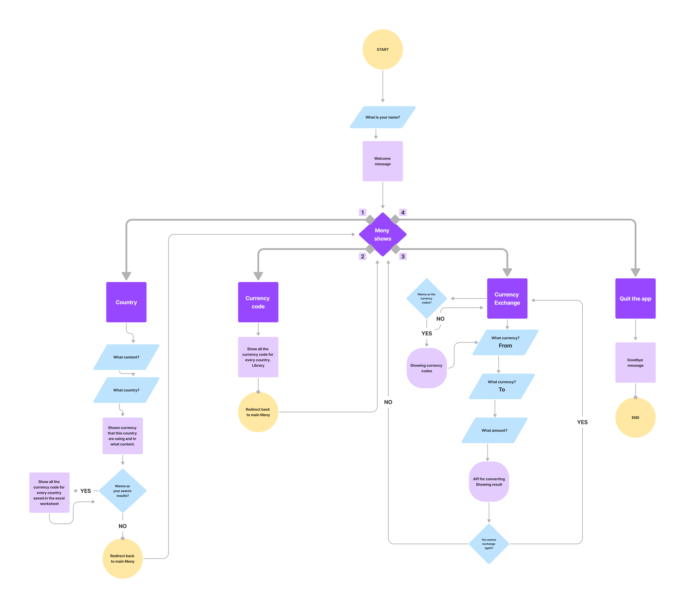
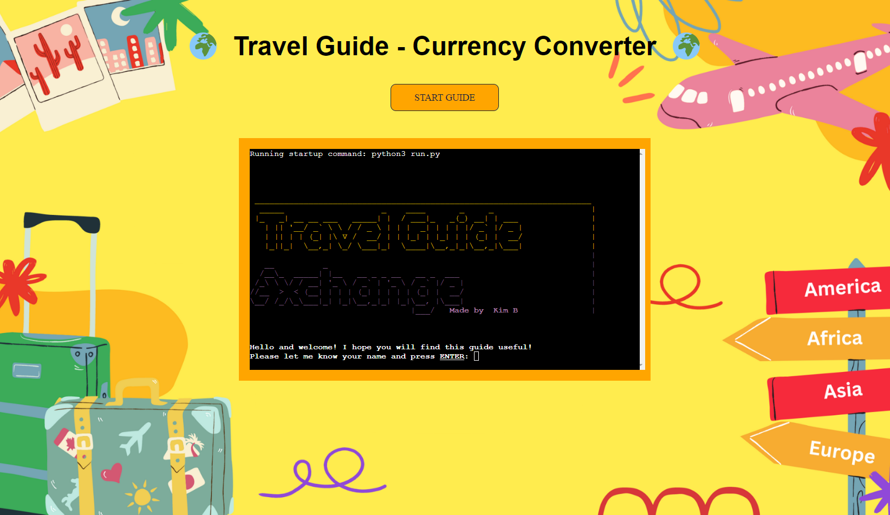
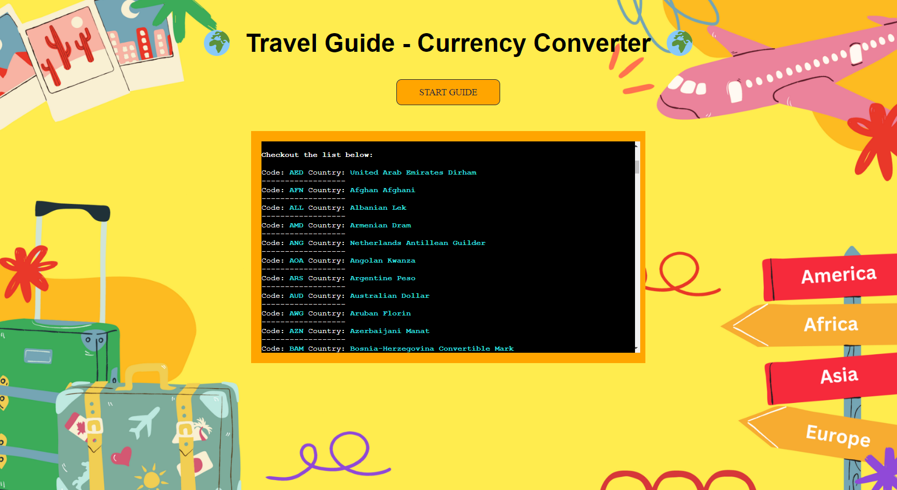
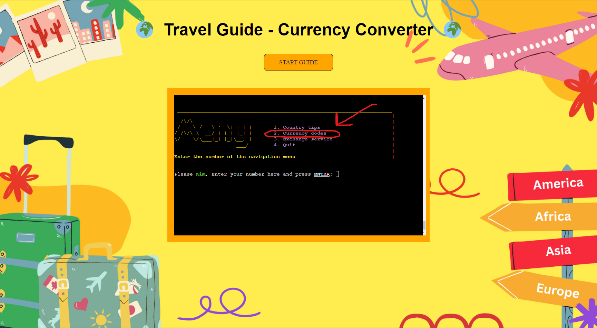
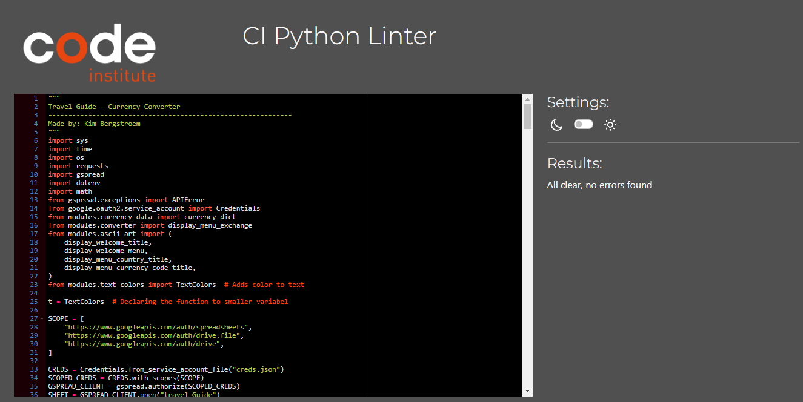
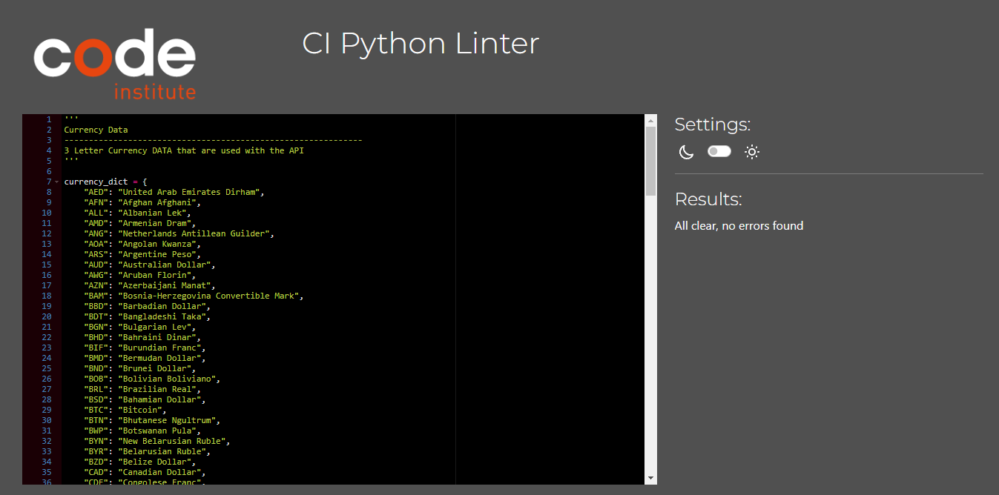
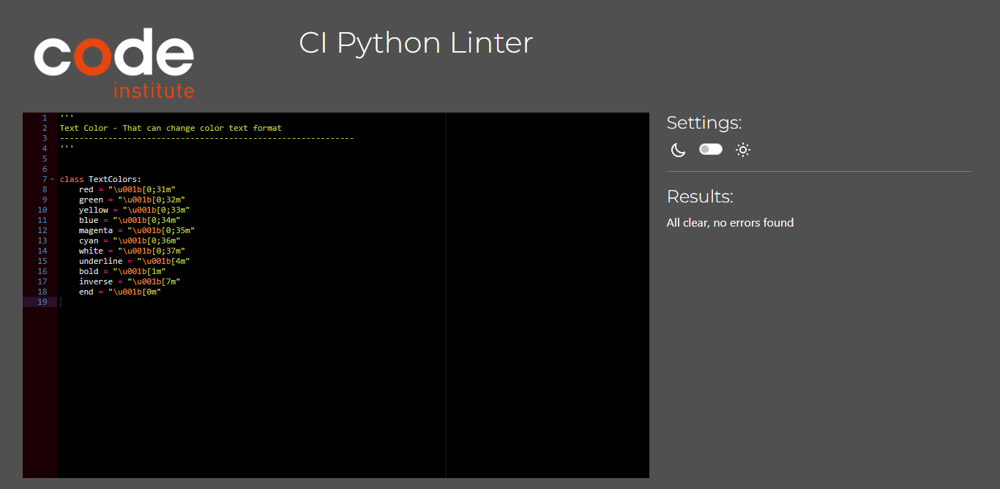
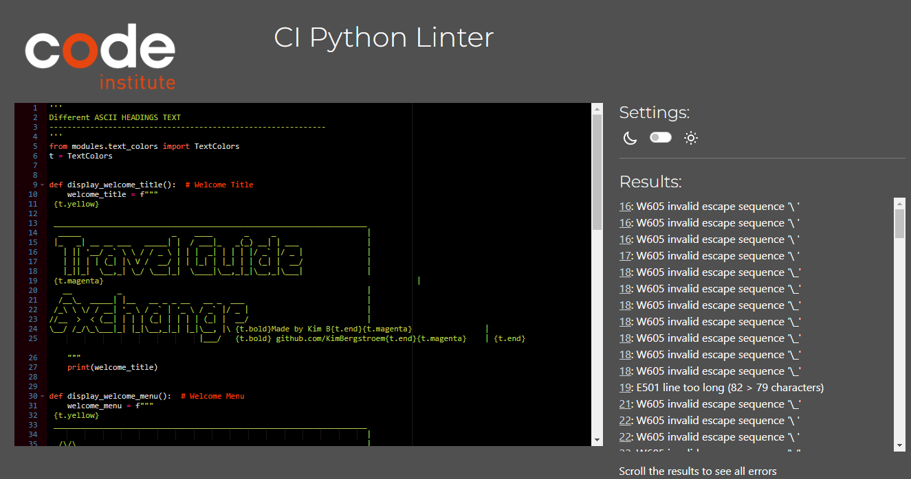

# Travel Guide / Currency Converter 🌎

**Visit the deployed site:** [travel_Guide](https://travel-guide.herokuapp.com/)

**Visit the repo here:** [GitHub PP3](https://github.com/KimBergstroem/PP3)

Do you know which currency is used in that country? Do you know how much your current currency is worth in that value?

The Currency Exchanger and Travel Guide is a **Python-based** 🐍 application that allows users to convert between different currencies and also engages them with a fun travel experience. The application aims to provide a convenient currency conversion tool while offering an enjoyable user experience through captivating design and travel-related questions.

&nbsp;

---

## **Table of Contents 🌎** 

- [User Story](#user-story-🌎)
- [How to Use Travel Guide](#how-to-use-travel-guide-🌎)
- [Program Flow](#program-flow-🌎)
- [Data Model](#data-model-🌎)
- [Technologies Used](#technologies-used-🌎)
- [Features](#features-🌎)
- [Testing](#testing-🌎)
- [Deployment](#deployment-🌎)
- [Credits](#credits-🌎)

---

## **User Story 🌎** 

### First Time Visitor Goals
* **As a first-time visitor**, I want to be greeted with a welcoming message and an engaging UX style to set the tone for my experience.
* **As a first-time visitor**, I want to be presented with a menu of options to explore, such as choosing a destination country or accessing currency conversion information.
* **As a first-time visitor**, I want to select a destination country and see the currency used in that country, providing me with valuable information for my travels.
* **As a first-time visitor**, I want to have the option to view a list of currency codes for different countries to help me with currency exchange.

### Returning Visitor Goals
* **As a returning visitor**, I want to quickly access the travel guide without having to go through the initial welcome and name input process.
* **As a returning visitor**, I want to explore different options in the menu, such as choosing a new destination country or reviewing currency conversion details.
* **As a returning visitor**, I want to check the currency code for a specific country without having to navigate through the entire travel guide.
* **As a returning visitor**, I want to compare currency exchange rates and perform currency conversions for different countries I'm interested in.
* **As a returning visitor**, I want to have an enjoyable and visually appealing experience with captivating design and engaging travel-related questions.

---

## **How to Use Travel Guide 🌎** 
The app will instantly display the converted amount based on current exchange rates. In addition to currency conversion, the app offers engaging travel-related questions to make your experience enjoyable. Explore destination recommendations and travel tips for your trip planning. Enjoy the convenience of currency conversion and the excitement of discovering new travel insights with the **travel_Guide** app.

---

## **Program Flow 🌎** 
The flowchart represents the logic of the <b>travel_Guide</b> application. The program starts by prompting the user to input their name and validates the input to ensure that the name is at least three letters long and contains only letters.

If the input is valid, a welcome message is shown briefly and then disappears. 
The terminal is cleared, and the program proceeds to display the main menu, offering four different options. Each option leads to a different path of choice by user:

1. <b>Country:</b>
This path prompts the user with different questions such as "Which content do you want to explore?" and "Which country are you interested in?". The user's inputs are processed using the Google Sheets API. If the inputs are valid string values, the information is saved and compared with existing data in the worksheet. This step ensures the correct currency is displayed for the selected country. The application provides the user with the accurate content, country, and currency information. Once all the necessary information is obtained, the user is prompted to either return to the main menu or perform another country search.

2. <b>Currency code:</b>
Choosing this path displays a library of all current currency codes automatically in the prompt. If the user is unfamiliar with the three-letter currency codes, they can select this option to view the codes. These codes are necessary for the currency exchange feature. After displaying the currency codes, the program automatically returns the user to the main menu.

3. <b>Currency Exchange:</b>
This path enables the user to input a currency and an amount to view the exchange rate. The currency exchange is facilitated by an API connected to the application, specifically the "Fixer API". This API provides daily updated rates between different currencies. The user is also presented with the result of the exchange, and if desired, they can choose to exchange another currency. Otherwise, the program asks whether the user wants to perform another currency exchange or return to the main menu.

4. <b>Exit:</b>
Finally, choosing option 4 displays the concluding message and exits the application. The terminal will be closed.

---

## **Data Model 🌎** 
The program uses the **Google Sheets API** to access a Google Sheet that contains content, country, and currency data. The program then saves and compares the placeholders for the user inputs and presents the resulting information. The program uses the `input()` function to get user choices and a series of validation functions to ensure that user inputs are valid.

The **Fixer API** is utilized in this application to provide access to real-time and historical exchange rate data for currency conversion purposes. It enables the integration of currency exchange functionality.

The application also imports **sys, time, os, requests, and gspread** modules to perform various tasks such as system interactions, time-related operations, HTTP requests, and Google Sheets integration.

---

## **Technologies Used 🌎**
### **Languages**
- **Python 3**: primary programming language for the project
- **HTML**, **CSS**, and **JavaScript** are also used but only manipulated for better UI experience for users.

### **Tools and Services**
- [Figma](https://www.figma.com/): an online diagramming tool used to create flowcharts for the project
- [Canva](https://www.canva.com/): an all-in-one design tool used to create professional-grade graphics and visual content
- [Gitpod](https://gitpod.io/): cloud-based IDE used for version control and coding
- [Git](https://git-scm.com/): version control system used for managing and tracking changes to the project's codebase
- [GitHub](https://github.com/): web-based hosting service used for version control and storing the project's code after being pushed from Gitpod
- [Heroku](https://www.heroku.com/home): cloud platform used for deploying and hosting the project's web application

---

## **Features 🌎** 
### **Existing Features**
The **travel_Guide** application currently offers the following features:

- **Currency Conversion**: Users can convert between different currencies using the application. By selecting the source currency, target currency, and entering the desired amount, the app provides the converted value based on current exchange rates.
- **Engaging Travel Experience**: The app incorporates travel-related questions and trivia, enhancing the user's experience while using the application.
- **Destination Recommendations**: Users can explore destination recommendations within the app, aiding them in trip planning and discovery.
- **User-Friendly Design**: The application has an intuitive and captivating design, ensuring a pleasant and enjoyable user interface.

### **Future Ideas**
Extended Feature Options: Provide more storylines or narrative options to allow users to select and engage with different paths.

- **Personalization**: Offer the option for users to name their travel destination or customize certain aspects of the travel experience to add a personalized touch.
- **Enhanced Story Interactions**: Develop interactive elements within the storylines, allowing users to make choices that have more significant impacts on the narrative, such as flight ticket prices or how much they can get in a specific country with 1 euro converted to the local currency.
- **Improved Validation and Error Handling**: Refine the validation and error handling mechanisms to provide more informative and user-friendly error messages in case of incorrect inputs or invalid data.
- **Data Saving**: Give users the option to save data into the worksheet, with personal travel tips or information to refer back to.

---

## **Validation 🌎**
All string validations use the `.capitalize()` or `.upper()` function to prevent any capitalization errors.

### **Name Validation:**
- Validating 3 or more letters - OK for username
- Only letters - OK for username
- Correct name input - OK for username
- Numbers instead of letters A-Z - OK, gives correct error message
- 2 letters inserted - OK, gives correct error message

### **Main Menu Validation:**
- Choosing numbers 1-4 - OK, takes the user to the selected option
- Trying another number besides "1-4" - OK, gives the correct error message
- Trying to insert a string instead - OK, gives the correct error message
- Anything else inserted - OK, gives the correct error message

### **Currency Code Validation:**
- If inputting the 3-letter code - OK, gives the user the option to exchange the currency and informs them that this currency code exists
- If inputting an integer instead of a string value - OK, gives the correct error message
- If inputting the wrong 3-letter code - OK, gives the correct error message displaying that this code is not an existing currency code
- Anything else inserted - OK, gives the correct error message

### **Data Search to Worksheet Validation:**
- If inputting the correct content/country string value - OK, gives the user information that this content/country exists.
- If inputting an integer instead of a string value - OK, gives the correct error message
- If inputting a blank space - OK, gives the correct error message
- Anything else inserted - OK, gives the correct error message

### **User typing "enter" Validation:**
- If inputting the correct string value "enter" - OK, gives the user information that this content/country exists.
- If inputting an integer instead of a string value - OK, gives the correct error message
- If inputting a blank space - OK, gives the correct error message
- Anything else inserted - OK, gives the correct error message

### **All (Y)es or (N)o Question Validation:**
- If jused with an IF statement as below code: &nbsp;

    `if` "N" `not in` "variable" `and` "Y" `not in` "variable":
    `print('Please press either "Y" for YES or "N" for NO')`
---

## **Testing 🌎**

### Testing User Stories

**First Time Visitors**

| User Story | How this was achieved | Screenshot |
|------------|-----------------------|------------|
| As a first-time visitor, I want to be greeted with a welcoming message and an engaging UX style, to set the tone for my experience. | The application displays a visually appealing welcome screen with a warm greeting and attractive design elements. | 

Screenshot of result

 |
| As a first-time visitor, I want to be presented with a menu of options to explore, such as choosing a destination country or accessing currency conversion information. | The application provides a clear and accessible menu with various options for the user to choose from. | 

Screenshot of result

 |
| As a first-time visitor, I want to select a destination country and see the currency used in that country, providing me with valuable information for my travels. | The application allows the user to select a destination country, and upon selection, displays the corresponding currency used in that country. | 

Screenshot of result

 |
| As a first-time visitor, I want to compare currency and perform currency conversions for different countries I'm interested in. | First-time visitors can utilize the currency exchange feature to compare rates and perform conversions for different currencies. | 

Screenshot of result

 |
| As a first-time visitor, I want to have the option to view a list of currency codes for different countries to help me with currency exchange. | The application provides a feature where the user can access a list of currency codes for different countries, aiding them in currency exchange-related activities. | 

Screenshot of result

 |

**Returning Visitors**

| User Story | How this was achieved | Screenshot |
|------------|-----------------------|------------|
| As a returning visitor, I want to explore different options in the menu, such as choosing a new destination country or reviewing currency conversion details. | Returning visitors can navigate through the menu and choose various options, including selecting a different destination country and reviewing currency conversion details. | 

Screenshot of result

 |
| As a returning visitor, I want to check the currency code for a specific country without having to navigate through the entire travel guide. | The application provides a dedicated section where returning visitors can quickly access and view the currency code for a specific country. | 

Screenshot of result

 |
| As a returning visitor, I want to compare currency exchange rates and perform currency conversions for different countries I'm interested in. | Returning visitors can utilize the currency exchange feature to compare rates and perform conversions for multiple countries of interest. | 

Screenshot of result

 |
| As a returning visitor, I want to have an enjoyable and visually appealing experience with captivating design and engaging travel-related questions. | The application maintains an engaging and visually appealing design throughout the user experience, incorporating captivating travel-related questions to enhance user enjoyment. | 

Screenshot of result

 |

&nbsp;

### Automated Testing
The **PEP8** validator was used to validate all Python modules and files in this project. No errors were found.

The only file that gave an error was the `ascii_art.py` file. The warnings are some lines that are too long, which can't be undone or shortened, whitespaces, and an invalid escape sequence. This can't be fixed without breaking the ASCII style that is being used.

The error code is the following:

`W605 invalid escape sequence '\ '`

`E501 line too long (82 > 79 characters)`

- [PEP8 - run.py](https://pep8ci.herokuapp.com/#)
    

- [PEP8 - converter.py](https://pep8ci.herokuapp.com/#)
    

- [PEP8 - currency_data.py](https://pep8ci.herokuapp.com/#)
    

- [PEP8 - text_colors.py](https://pep8ci.herokuapp.com/#)
    

- [PEP8 - ascii.py](https://pep8ci.herokuapp.com/#)
    

&nbsp;

### Manual Testing
Family and friends tested my app on their devices, and no issues were reported.

The scores below are the average results obtained from three users who attempted the following tests:

| Test | Result |
|------|--------|
| Welcome message and user name validation | **`100%`** |
| Main menu option validation (selecting an invalid option) | **`100%`** |
| Currency conversion function (testing with different amounts) | **`100%`** |
| Currency exchange validation (selecting the wrong currency) | **`100%`** |
| Blank space validation for all inputs | **`100%`** |
| Validation of integer inputs for "Y" and "N" questions | **`100%`** |

&nbsp;

### **Solved Bugs**
| Type   | Bug | Solution |
|--------|-----|----------|
| run.py | Couldn't find countries in the worksheet that had blank spaces in their names, such as "Sri Lanka" or "New Zealand." This caused the application to display an error message stating that the country does not exist in the list, even though it actually does. | Used `.capitalize()` `.strip()` to remove leading/trailing spaces and also changed the worksheet entry from "Sri Lanka" to "Sri lanka" with only the first letter capitalized. |
| run.py | The application crashed when users attempted multiple searches for a country or currency due to the "Read requests per minute per user" limit on the Google Sheets API. This `gspread.APIError` occurred when the limit was exceeded. | Implemented a `try-except` block to handle the API error. When the error occurs, an appropriate message is displayed to the user, advising them to wait or return to the main menu and wait for 1 minute before making another request. |
| run.py | The application would crash when users entered invalid inputs such as blank spaces, integers, or string values where they were not expected. These inputs were not handled properly, resulting in a program crash. | Implemented stricter validation checks on the different input questions and displayed appropriate error messages when an invalid input was entered. |
| run.py | The currency conversion process was stuck in an endless loop, causing the program to hang indefinitely. | Identified that a while loop condition was missing an exit condition and added a break statement to terminate the loop once the conversion was complete. |

&nbsp;

### **Known Bugs**
| Type   | Bug | Possible Solution |
|--------|-----|------------------|
| run.py | Slow response time when accessing currency data | The program takes a long time to retrieve and display currency data, causing delays in the user experience. This could be due to slow network connections or inefficient data retrieval methods. |

&nbsp;

---

## **Deployment 🌎**
To deploy this project, follow these steps:

1. Fork and clone this repository to your local machine.
2. Create a new Heroku app.
3. In the Heroku dashboard, navigate to the app's settings and set the buildpacks to Python and NodeJS in that order.
4. Connect your Heroku app to the repository by linking it to your forked copy of the repository.
5. Click on the "Deploy" button in the Heroku dashboard.

After following these steps, your app should be successfully deployed to Heroku.

---

## **Credits 🌎**

The inspiration for this project's development came from a range of online resources, including tutorials from Simplilearn and Stack Overflow. Additionally, references from websites like W3Schools and Code Institute's learning platform were utilized.

- [Learn Learn Scratch Tutorials](https://www.youtube.com/watch?v=u4QmAIoo4i0) for their tutorial on how to include colors in the Python terminal.
- [Simplilearn](https://www.simplilearn.com/tutorials/python-tutorial/list-to-string-in-python) for their tutorial on list-to-string conversion in Python.
- [101Computing](https://www.101computing.net/number-only/) for their tutorial on try and except learning.
- [W3Schools](https://www.w3schools.com/python/ref_string_join.asp) for their tutorial on the `join()` method in Python.
- [Scaler](https://www.scaler.com/topics/capitalize-in-python/) for their tutorial on capitalizing strings in Python.
- [Stack Overflow](https://stackoverflow.com/questions/5904969/how-to-print-a-dictionarys-key) for insights on displaying keys and values in a formatted form.
- [Code Institute](https://codeinstitute.net/global/) for general Python programming tips and guidance.
- [ItNext.io](https://itnext.io/overwrite-previously-printed-lines-4218a9563527) for teaching line clearing and line removal using the `time` module.
- [Gspread](https://docs.gspread.org/en/latest/) library documentation for guidance on accessing cells and values in Google Sheets.
- [nkmk](https://note.nkmk.me/en/python-textwrap-wrap-fill-shorten/) for discussions on using the `textwrap` module and text formatting.
- [Scaler](https://www.scaler.com/topics/how-to-clear-screen-in-python/) for discussions on clearing the screen in Python.

### **Acknowledgments**

I'd like to give recognition to the individuals who supported me in completing this project:

* My family, for their patience and assistance in identifying spelling mistakes and testing issues. Their support has been invaluable in improving the quality of this project.
* Testers [Debbie B](https://github.com/DebbieBergstrom) and [Sandra B](https://github.com/SandraBergstrom) for their significant contributions in providing feedback, identifying errors, and offering valuable insights.
* [Jubril](https://github.com/Jubrillionaire), my Code Institute Mentor, for his exceptional guidance and expertise, which greatly contributed to my growth as a developer.

(<a href="#readme-top">back to top</a>)

--- 
&nbsp;
